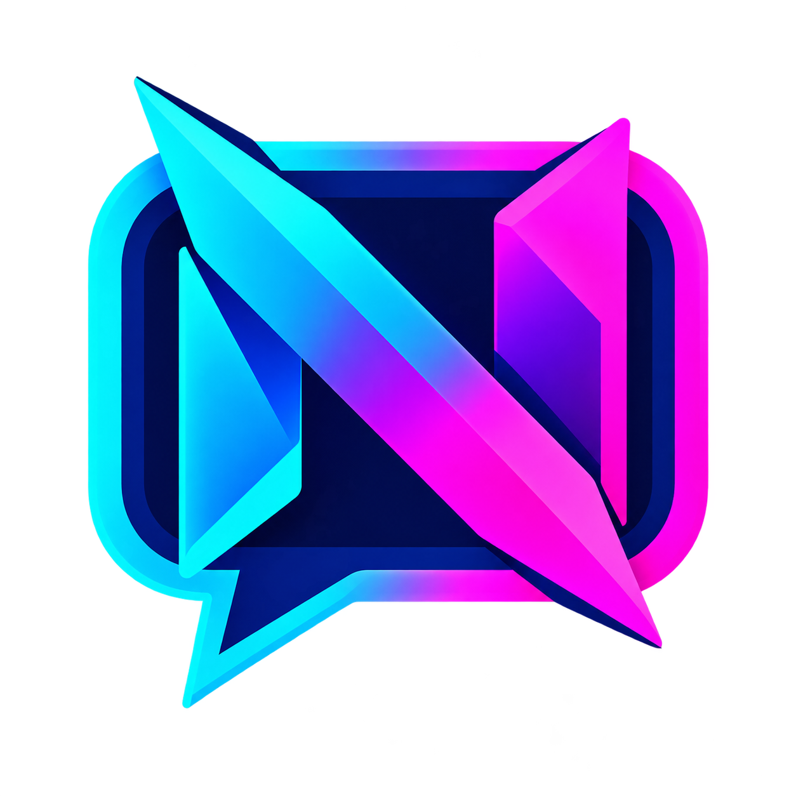

# Netrunner Overlay Engine

  

Aplicativo para reunir chats de lives da Twitch, YouTube, TikTok e Kick em um único overlay para o OBS Studio.

## Recursos

- Captura simultânea de até quatro plataformas.
- Overlay transparente para fonte de navegador do OBS.
- Pré-visualização das mensagens dentro do aplicativo.
- Identificação visual da plataforma em cada mensagem.
- Botão para copiar o link do OBS.
- Encerramento e reconexão da captura sem reiniciar o aplicativo.
- Editor integrado de HTML, CSS e JavaScript do overlay.
- Encerramento completo do processo ao fechar a janela.

## Download e execução

1. Abra a página **Releases** deste repositório.
2. Baixe `NetrunnerOverlay-v1.0.0-windows-x64.zip`.
3. Extraia o arquivo ZIP.
4. Execute `NetrunnerOverlay.exe`.

O Windows SmartScreen pode exibir um aviso porque o executável ainda não possui assinatura digital. Nesse caso, confira se o arquivo veio da página oficial de Releases antes de escolher **Mais informações > Executar assim mesmo**.

## Como usar

Preencha somente as plataformas que deseja capturar:

- **Twitch:** nome do canal, `@canal` ou URL do canal.
- **YouTube:** URL da live ou ID do vídeo.
- **TikTok:** `@usuario` ou nome do usuário.
- **Kick:** nome, `@canal` ou URL do canal.

Clique em **INICIAR CAPTURA**. Para trocar canais, clique em **ENCERRAR CAPTURA**, altere os campos e use **INICIAR / RECONECTAR CAPTURA**.

## Configuração no OBS

1. No aplicativo, clique em **COPIAR LINK DO OBS**.
2. No OBS, adicione uma fonte **Navegador**.
3. Cole a URL `http://127.0.0.1:5000`.
4. Use uma largura e altura adequadas ao layout da sua transmissão, por exemplo 600 × 800.
5. Ative **Atualizar navegador quando a cena se tornar ativa** se quiser forçar a atualização ao trocar de cena.

O Netrunner precisa permanecer aberto enquanto o OBS usa o overlay. Consulte [Configuração do OBS](docs/OBS.md) para instruções detalhadas.

## Solução rápida de problemas

- **Overlay vazio:** confirme que o aplicativo está aberto e atualize o cache da fonte Navegador no OBS.
- **Uma plataforma não conecta:** confira o nome/URL e se a live está ativa.
- **Mudou o canal:** encerre a captura antes de editar os campos e reconecte.
- **Porta 5000 ocupada:** feche outra instância do Netrunner ou o programa que esteja usando essa porta.
- **Antivírus bloqueou o arquivo:** baixe novamente pela Release oficial e confira o SHA-256 publicado.

## Distribuição

Este repositório público distribui os executáveis oficiais e a documentação do Netrunner. O código-fonte permanece fechado nesta fase do projeto. Não baixe cópias publicadas fora da página oficial de Releases.

Consulte o arquivo `SHA256SUMS.txt` de cada Release para verificar a integridade do download.

## Aviso

Este projeto é independente e não possui vínculo oficial com Twitch, YouTube, TikTok, Kick ou OBS. Mudanças feitas pelas plataformas podem interromper temporariamente alguma integração.
