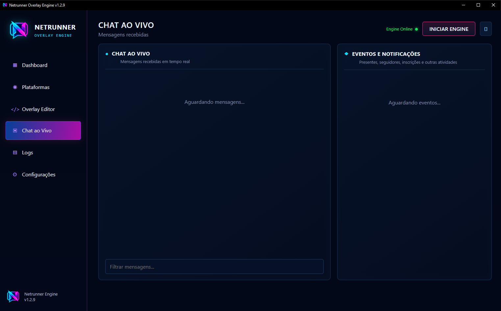

# Netrunner Overlay Engine

<p align="center">
  
</p>

O Netrunner reúne mensagens públicas de lives da Twitch, YouTube, TikTok e Kick em um único chat para exibição no OBS Studio. Não é necessário informar senhas, cookies ou credenciais das suas contas.


## Instalação

1. Abra a página **Releases** deste repositório.
2. Baixe `NetrunnerOverlay-Setup-v1.3.1-windows-x64.exe`.
3. Execute o instalador e escolha o idioma.
4. Ao concluir, abra **Netrunner Overlay Engine** pelo Menu Iniciar ou pelo atalho opcional da área de trabalho.

Requisitos: Windows 10 ou 11 de 64 bits, conexão com a internet e Microsoft Edge WebView2 Runtime. O OBS Studio é necessário apenas para usar o overlay em uma transmissão.

O Windows SmartScreen pode mostrar um aviso enquanto o instalador não possui assinatura digital. Confirme que o arquivo veio da Release oficial e compare seu SHA-256 com `SHA256SUMS.txt` antes de executá-lo.

Depois de instalado, use **Configurações → Atualizações → Verificar
atualizações**. O aplicativo consulta um manifesto HTTPS publicado junto da
Release, baixa o instalador, confere o SHA-256 e só então inicia a atualização.

## Como usar

Abra **Plataformas** e preencha somente os canais que deseja acompanhar:

- **Twitch:** nome ou URL do canal.
- **YouTube:** URL da live, ID do vídeo ou `@` do canal. Ao usar `@`, o
  Netrunner procura a transmissão ativa do canal automaticamente.
- **TikTok:** nome ou `@` do canal.
- **Kick:** nome ou URL do canal.

Clique em **Iniciar / Reconectar captura**. Para trocar algum canal, encerre a captura, altere os campos e conecte novamente.


## Usar no OBS

1. Abra o Dashboard pelo aplicativo e copie os links seguros de chat e eventos, que já incluem os tokens necessários para o OBS.
2. No OBS, adicione uma fonte **Navegador** para cada overlay que deseja exibir.
3. Comece com 600 × 800 e ajuste ao layout da sua transmissão.
4. Mantenha o Netrunner aberto enquanto o overlay estiver em uso.

Consulte o [guia do OBS](docs/OBS.md) se precisar atualizar a fonte ou resolver um overlay vazio.

## Personalizar o overlay

O **Overlay Editor** permite ajustar a aparência e acompanhar a mesma prévia que será exibida no OBS. Depois de editar, clique em **Salvar e aplicar**.


O editor é dividido em **Overlay de chat** e **Overlay de eventos**. Cada um tem HTML, CSS e JavaScript próprios, modelo base, lista de overlays salvos, importação, exportação, prévia e botão **Salvar e aplicar**. Os arquivos ficam separados em:

```text
%LOCALAPPDATA%\NetrunnerOverlay\overlays\chat
%LOCALAPPDATA%\NetrunnerOverlay\overlays\events
```

Os dois modelos usam fundo transparente. Consulte o [guia completo de overlays](docs/OVERLAYS.md) para conhecer os formatos JSON, endpoints de polling e exemplos de templates. Para doações externas, veja o [guia de pagamentos](docs/PAYMENTS.md).



## Idiomas e configurações

A interface está disponível em Português, Inglês, Espanhol e Francês. O idioma pode ser alterado em **Configurações**.


Em **Configurações → Saúde do sistema**, use **Validar Browser Sources** antes
da live para conferir os links de chat/eventos, transparência, runtime e assets.
O **Teste de resiliência** observa a fila e o transporte realtime pelo tempo
escolhido sem injetar mensagens ou alertas falsos na transmissão. Para validar
o comportamento real do OBS, deixe a fonte aberta durante um teste longo e
confira o resultado no dashboard.

## Desinstalação

1. Abra **Configurações do Windows → Aplicativos → Aplicativos instalados**.
2. Localize **Netrunner Overlay Engine**.
3. Abra o menu do aplicativo e clique em **Desinstalar**.

O desinstalador pergunta se você também deseja apagar as personalizações salvas. Escolha **Não** para preservá-las para uma instalação futura.

## Solução rápida de problemas

- **Overlay vazio:** confirme que o Netrunner está aberto e atualize o cache da fonte Navegador no OBS.
- **Uma plataforma não conecta:** confira o canal informado e se a live está ativa.
- **TikTok mostra HTTP 400:** use a build atual, que corrige a codificação da
  URL do WebSocket e a entrada na sala do chat. Esse código de erro, sozinho,
  não indica que uma chave de API é necessária.
- **Mensagens pararam:** encerre e reconecte a captura; depois atualize a fonte no OBS.
- **Diagnóstico do dashboard:** abra **Configurações → Saúde do sistema**. Se o
  Browser Source falhar, copie novamente o link seguro; se o WebSocket estiver
  opcional/offline, o polling HTTP continua sendo usado como fallback.
- **Porta 5000 ocupada:** feche outra instância do Netrunner ou o programa que estiver usando essa porta.
- **Arquivo bloqueado pelo antivírus:** baixe novamente somente pela Release oficial e confira o SHA-256.

## Privacidade

- As mensagens permanecem temporariamente na memória e não são gravadas em histórico pelo Netrunner.
- O aplicativo não possui telemetria própria nem solicita credenciais das plataformas.
- O servidor do overlay aceita somente conexões locais em `127.0.0.1`.
- O projeto é independente e não possui vínculo oficial com Twitch, YouTube, TikTok, Kick ou OBS.

O código-fonte proprietário permanece fechado. O download oficial é distribuído somente como instalador e segue a [licença de distribuição binária](LICENSE.md). Componentes de terceiros mantêm suas próprias licenças, descritas em [Avisos de terceiros](THIRD_PARTY_NOTICES.md).


