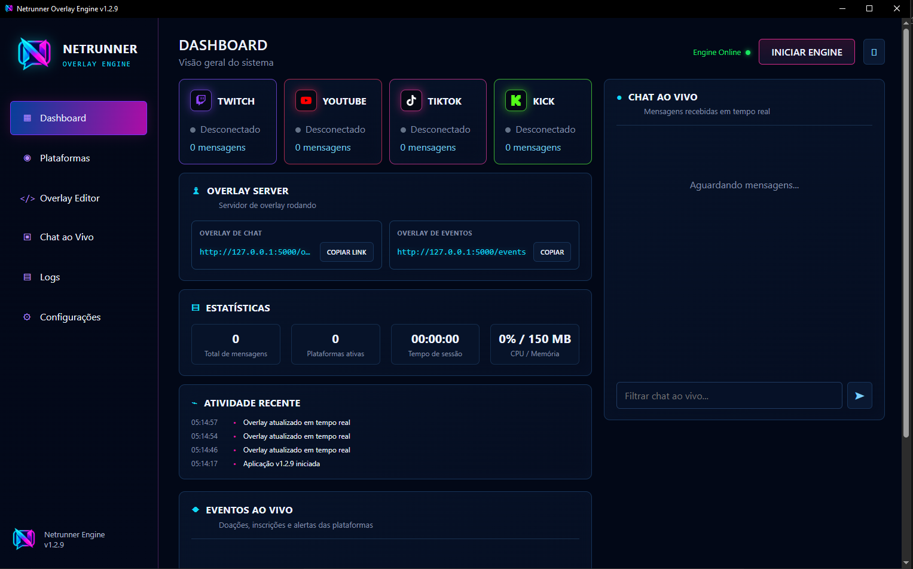
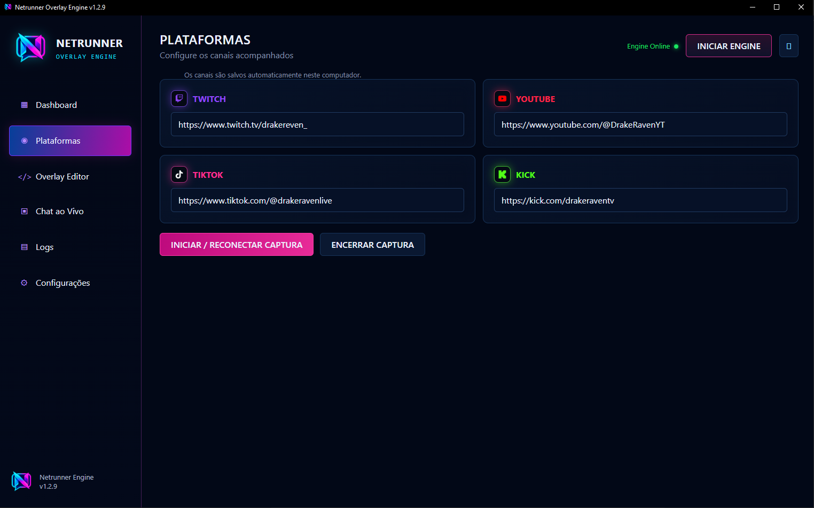
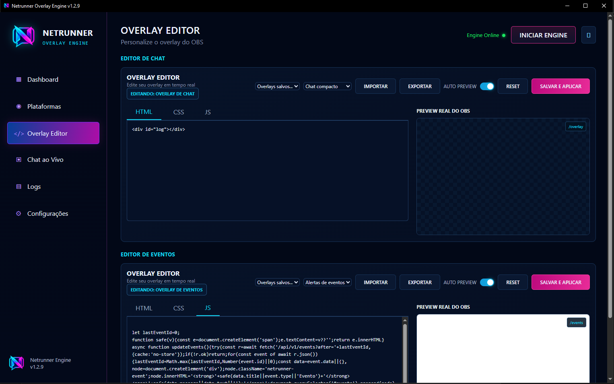
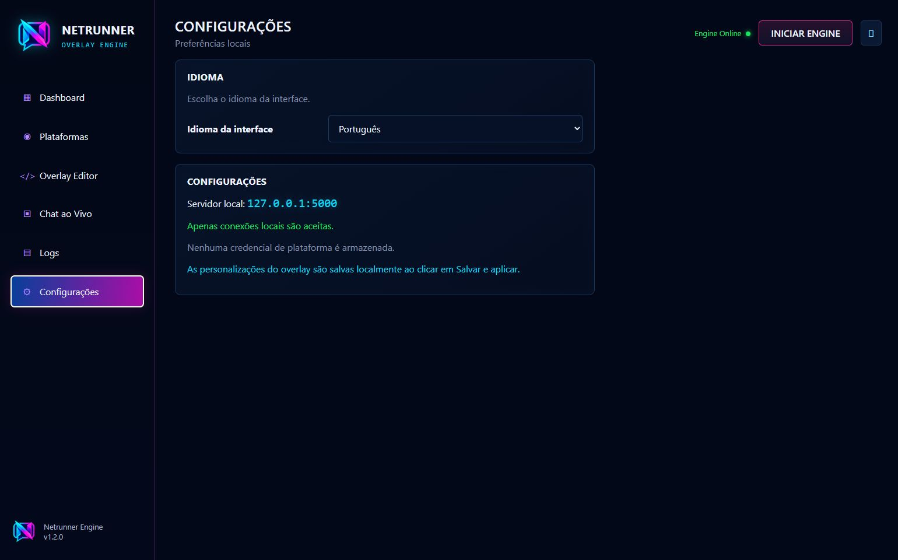

# Netrunner Overlay Engine

<p align="center">
  
</p>

O Netrunner reúne mensagens públicas de lives da Twitch, YouTube, TikTok e Kick em um único chat para exibição no OBS Studio. Não é necessário informar senhas, cookies ou credenciais das suas contas.



## Instalação

1. Abra a página **Releases** deste repositório.
2. Baixe `NetrunnerOverlay-Portable-v1.2.6-windows-x64.zip` (recomendado).
3. Extraia o arquivo ZIP.
4. Execute `NetrunnerOverlay.exe`.

O arquivo `NetrunnerOverlay-Setup-v1.2.6-windows-x64.exe` está disponível como alternativa para quem prefere instalação automática, atalhos e desinstalador integrado.

A edição portátil é o download recomendado porque não usa um empacotador de instalação: basta extrair e abrir o aplicativo. O instalador pode receber alertas heurísticos isolados por causa do formato do pacote e da ausência de assinatura digital, mesmo quando o executável interno está limpo. Verifique sempre os hashes publicados na Release oficial.

Requisitos: Windows 10 ou 11 de 64 bits, conexão com a internet e Microsoft Edge WebView2 Runtime. O OBS Studio é necessário somente para utilizar o overlay em uma transmissão.

O Windows SmartScreen pode mostrar um aviso enquanto o instalador não possui assinatura digital. Confirme que o arquivo veio da Release oficial e compare seu SHA-256 com `SHA256SUMS.txt` antes de executá-lo.

Depois de instalado, use **Configurações → Atualizações → Verificar
atualizações**. O aplicativo consulta o manifesto HTTPS da Release, baixa o
instalador, confere o SHA-256 e só então inicia a atualização.

**Arquivo bloqueado pelo antivírus:** alguns mecanismos heurísticos podem sinalizar o instalador por causa do empacotador e da ausência de assinatura digital. Prefira a edição portátil, baixe somente pela Release oficial e confira o SHA-256 em `SHA256SUMS.txt`. Consulte a [Política de Segurança](SECURITY.md) para mais detalhes.

## Como usar

Abra **Plataformas** e preencha somente os canais que deseja acompanhar:

- **Twitch:** nome ou URL do canal.
- **YouTube:** URL da live, ID do vídeo ou `@` do canal. Ao usar `@`, o
  Netrunner localiza a transmissão ativa do canal automaticamente.
- **TikTok:** nome ou `@` do canal.
- **Kick:** nome ou URL do canal.

Clique em **Iniciar / Reconectar captura**. Para trocar algum canal, encerre a captura, altere os campos e conecte novamente.



## Usar no OBS

1. No Dashboard, clique em **Copiar link**.
2. No OBS, adicione uma fonte **Navegador**.
3. Cole `http://127.0.0.1:5000/overlay` no campo URL.
4. Comece com 600 × 800 e ajuste ao layout da sua transmissão.
5. Mantenha o Netrunner aberto enquanto o overlay estiver em uso.

Consulte o [guia do OBS](docs/OBS.md) se precisar atualizar a fonte ou resolver um overlay vazio.

## Personalizar o overlay

O **Overlay Editor** permite ajustar a aparência e acompanhar a mesma prévia que será exibida no OBS. Depois de editar, clique em **Salvar e aplicar**.



As personalizações ficam salvas em:

```text
%LOCALAPPDATA%\NetrunnerOverlay\overlay.json
```

Esse arquivo contém somente o HTML, CSS e JavaScript personalizados do overlay. Ele pode ser copiado como backup e restaurado no mesmo local.

## Idiomas e configurações

A interface está disponível em Português, Inglês, Espanhol e Francês. O idioma pode ser alterado em **Configurações**.



## Desinstalação

1. Abra **Configurações do Windows → Aplicativos → Aplicativos instalados**.
2. Localize **Netrunner Overlay Engine**.
3. Abra o menu do aplicativo e clique em **Desinstalar**.

O desinstalador pergunta se você também deseja apagar as personalizações salvas. Escolha **Não** para preservá-las para uma instalação futura.

## Solução rápida de problemas

- **Overlay vazio:** confirme que o Netrunner está aberto e atualize o cache da fonte Navegador no OBS.
- **Uma plataforma não conecta:** confira o canal informado e se a live está ativa.
- **Mensagens pararam:** encerre e reconecte a captura; depois atualize a fonte no OBS.
- **Porta 5000 ocupada:** feche outra instância do Netrunner ou o programa que estiver usando essa porta.
- **Arquivo bloqueado pelo antivírus:** baixe novamente somente pela Release oficial e confira o SHA-256.

## Verificação do download

Depois de baixar o arquivo, abra o PowerShell na pasta do download e execute:

```powershell
Get-FileHash -Algorithm SHA256 .\NetrunnerOverlay-Portable-v1.2.6-windows-x64.zip
```

Compare o resultado com o hash registrado no arquivo `SHA256SUMS.txt` da mesma Release. Não execute o programa se os valores forem diferentes.

## Privacidade e segurança

- As mensagens ficam temporariamente na memória do aplicativo e não são gravadas em um histórico local pelo Netrunner.
- O aplicativo não possui telemetria própria nem solicita credenciais das plataformas.
- O servidor do overlay aceita somente conexões locais em `127.0.0.1`.
- O projeto é independente e não possui vínculo oficial com Twitch, YouTube, TikTok, Kick ou OBS.

O código-fonte proprietário permanece fechado. O download oficial é distribuído como pacote portátil e instalador, ambos regidos pela [licença de distribuição binária](LICENSE.md). Componentes de terceiros mantêm suas próprias licenças, descritas em [Avisos de terceiros](THIRD_PARTY_NOTICES.md).
